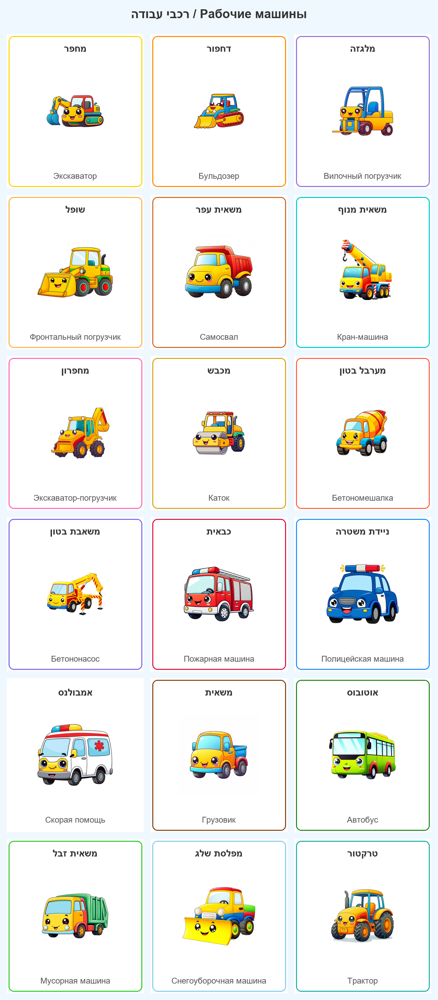
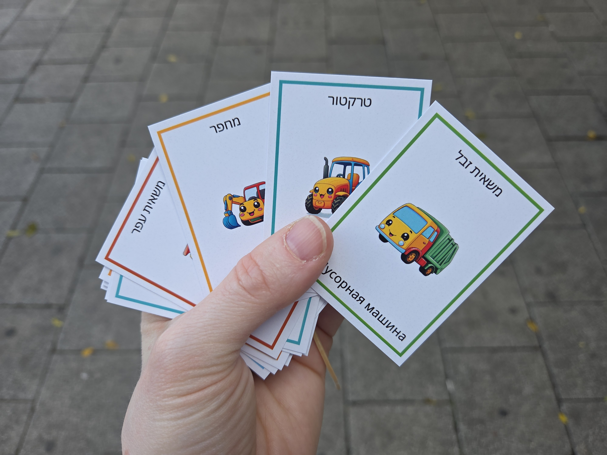

# Cards-4Kids

Multilingual children's vehicle flashcard generator. Uses Google Gemini AI to create cute kawaii-style cartoon vehicle images, then assembles them into print-ready cards and grid posters labeled in Hebrew and Russian.





## Features

- **AI Image Generation** — Generates cute vehicle illustrations via API calls to Gemini 2.0 Flash
- **Grid Poster** — Combines all vehicles into a single labeled poster image
- **Print-Ready Cards** — Individual 5 cm x 7 cm cards at 300 DPI, ready for home printing
- **Bilingual Labels** — Each vehicle labeled in Hebrew (top) and Russian (bottom)
- **Easy Configuration** — Add or modify vehicles by editing a simple text file

## Vehicle Categories

| Category | Vehicles |
|----------|----------|
| Construction | Excavator, Bulldozer, Forklift, Shovel Loader, Dump Truck |
| Cranes | Truck Crane, Backhoe Loader |
| Road & Concrete | Road Roller, Cement Mixer, Concrete Pump |
| Emergency | Fire Truck, Police Car, Ambulance |
| Transport | Truck, Bus |
| Utility | Garbage Truck, Snow Plow |
| Farm | Tractor |

## Prerequisites

- Python 3.12+
- A [Google Gemini API key](https://ai.google.dev/)
- Windows (font paths are currently Windows-specific)

## Setup

```bash
git clone https://github.com/<your-username>/Cards-4Kids.git
cd Cards-4Kids
pip install -r requirements.txt

# Set your Gemini API key
export GEMINI_API_KEY='your-key-here'
```

## Usage

```bash
# Run the full pipeline (generate images + create grid)
python pipeline.py

# Generate images only
python pipeline.py generate

# Create grid poster only (uses existing images)
python pipeline.py grid

# Create individual print-ready cards (5x7 cm at 300 DPI)
python pipeline.py cards

# Regenerate a specific vehicle
python pipeline.py generate --vehicle bulldozer

# Regenerate multiple specific vehicles
python pipeline.py generate --vehicle fire_truck --vehicle ambulance

# Verbose output
python pipeline.py --verbose
```

## Project Structure

```
Cards-4Kids/
├── pipeline.py          # CLI entry point
├── config.py            # All configuration (paths, prompts, layout)
├── vehicles.txt         # Vehicle definitions (pipe-separated)
├── requirements.txt     # Python dependencies
├── src/
│   ├── models.py        # Vehicle data model (Pydantic)
│   ├── loader.py        # Parses vehicles.txt
│   ├── generator.py     # Gemini image generation
│   ├── grid_builder.py  # Grid poster assembly
│   └── card_builder.py  # Individual card creation
├── images/              # Curated vehicle images (18 PNGs)
├── output/              # Generated output (grid poster + cards)
│   └── cards/           # Individual print cards
└── examples/            # Sample output for reference
    └── grid_preview.png
```

## Adding a Vehicle

Edit `vehicles.txt` and add a line in this format:

```
id | English Name | Hebrew | Russian | #HexColor
```

Optional description field for detailed image prompts:

```
id | English Name | Hebrew | Russian | #HexColor | Detailed description for AI
```

Then run `python pipeline.py` to generate its image and rebuild the grid.

## Configuration

All settings are in `config.py`:

| Setting | Default | Description |
|---------|---------|-------------|
| `GEMINI_MODEL` | `gemini-2.0-flash-exp` | Gemini model for generation |
| `GRID_COLS` | `3` | Columns in the grid poster |
| `CELL_WIDTH` / `CELL_HEIGHT` | `400` / `450` | Grid cell dimensions (px) |
| `BACKGROUND_COLOR` | `#F0F8FF` | Grid background color |
| `GENERATION_DELAY` | `2` | Seconds between API calls |

## License

This project is for personal/educational use.
